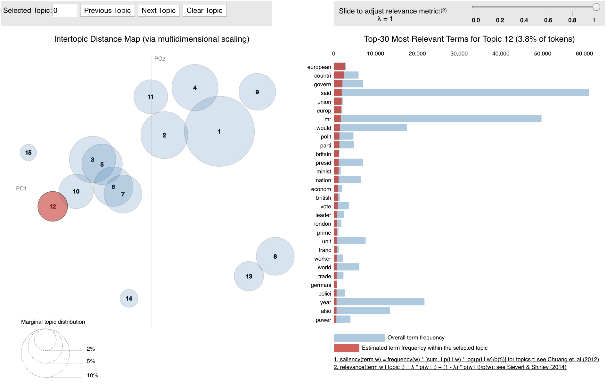

# Visual Topic Modeling

In this project I practiced visualising the topics learned by training a Latent Dirichlet Allocation topic model on the publicly available New York Times dataset (available here: https://www.kaggle.com/nzalake52/new-york-times-articles).

Requirements:

- Python 2 / 3
- numpy + pandas
- nltk
- gensim
- pyLDAvis

Topic modeling is an extremely useful tool for studying documents in any system. Good topic models have a variety of applications, for example, similarities between documents can be used to create a simple recommendation system.

Finding the ideal hyperparameters and topic number for the topic model you want to train can be long. Here I present both a qualitative and a quantitative way of evaluating your topic models and speeding up your topic modeling process!

 Visualisation can speed things up as often it is intuitive to tell whether or not there are a lot of overlapping topics, thus helping you select the ideal number of topics for your model. Using a metric such as coherence gives you a quantitative measure to analyse your model with. As a brief explanation of the coherence measure, I quote [this excellent paper on topic coherence](http://svn.aksw.org/papers/2015/WSDM_Topic_Evaluation/public.pdf), "A set of statements or facts is said to be coherent, if they
support each other. Thus, a coherent fact set can be interpreted in a context that covers all or most of the facts.". An in-depth discussion of topic coherence is presented in this paper, and I recommend you read it if coherence is a new concept to you!

The iterative process of finding a good general topic model becomes faster when using these two methods. Studying each topic and their top words can also give insights as to how to change the vocabulary for a better model and how to change the parameters in our train_lda function that define the representation of topics. 

The most important parameters to choose for this model are the vocabulary size and number of topics. The chunksize, alpha and eta in our train_lda function can also be tuned.

