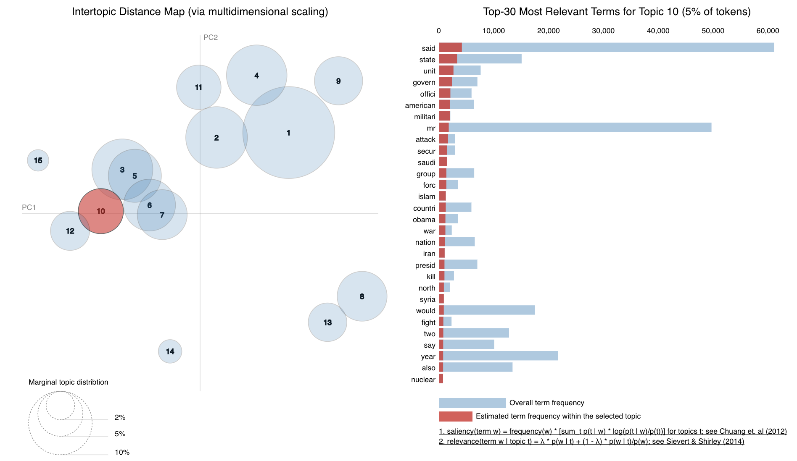

# Visual Topic Modeling

In this project I practiced visualising the topics learned by training a Latent Dirichlet Allocation topic model on the publicly available New York Times dataset (available here: https://www.kaggle.com/nzalake52/new-york-times-articles).

Requirements:

- Python 2 / 3
- numpy + pandas
- nltk
- gensim
- pyLDAvis

Topic modeling is an extremely useful tool for studying documents in any system. Good topic models have a variety of applications, for example, similarities between documents can be used to create a simple recommendation system.

Finding the ideal hyperparameters and topic number for the topic model you want to train can be long, however by visualising the model this process can be sped up. Often it is intuitive to tell whether or not there are a lot of overlapping topics, thus helping you select the ideal number of topics for your model.

The iterative process of finding a good general topic model becomes slightly more intuitive when visualising the topic distribution. Studying each topic and their top words can also give insights as to how to change the vocabulary for a better model and how to change the parameters in our train_lda function that define the representation of topics. 

The most important parameters to choose for this model are the vocabulary size and number of topics. The chunksize, alpha and eta in our train_lda function can also be tuned.

